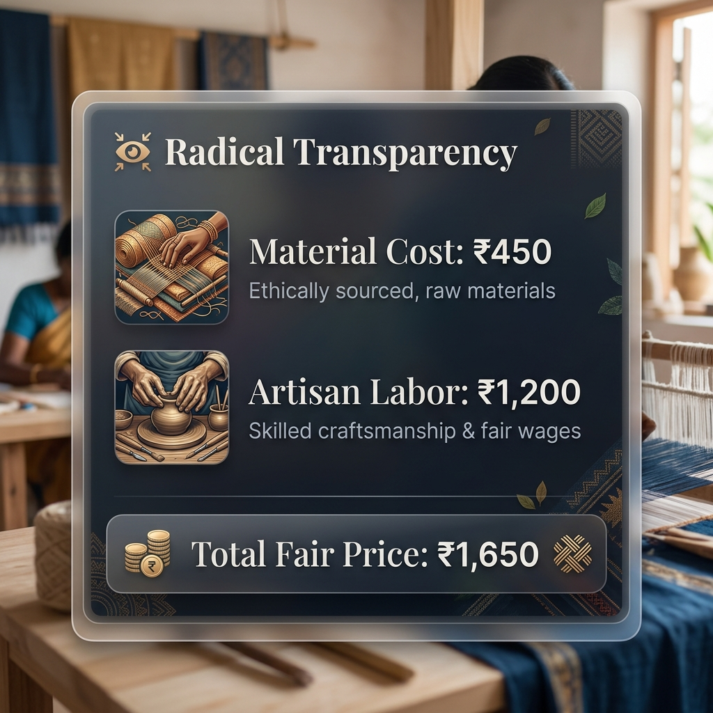
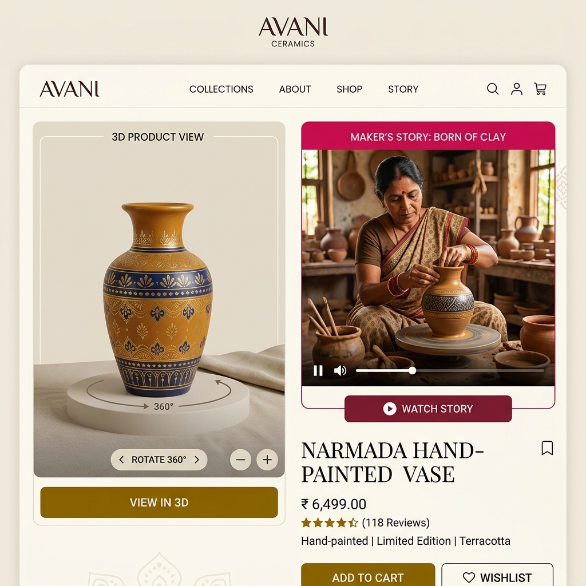
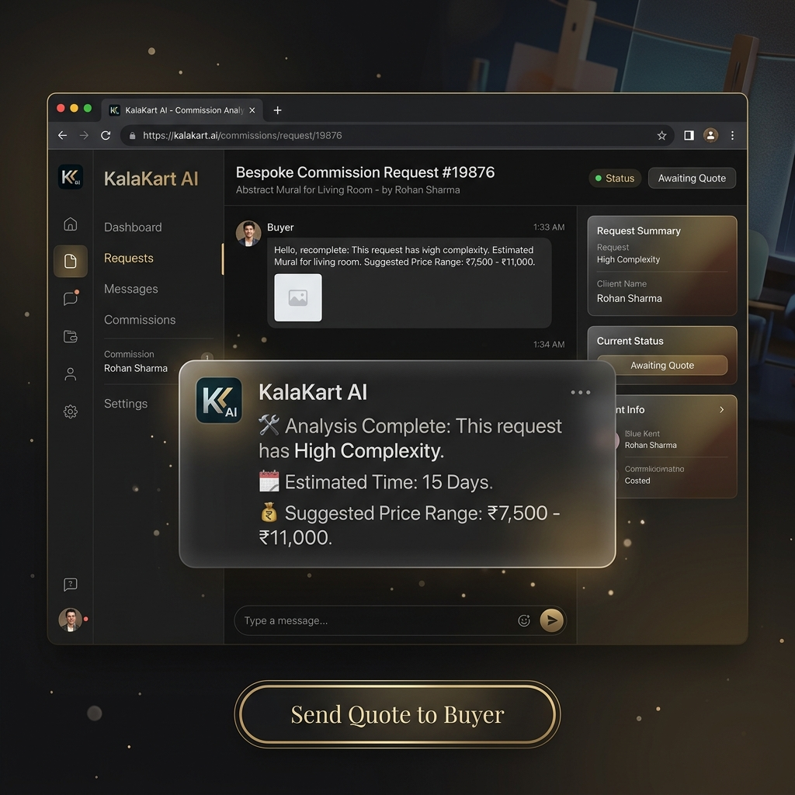

# KalaKart - AI + Artisan E-commerce Platform 🎨🛍️

> **"Connecting India's finest artisans directly with the world."**

KalaKart is a modern, full-stack e-commerce application designed to empower local artisans by providing them with a platform to sell their handcrafted goods. Built with the MERN stack (MongoDB, Express, React, Node.js), it features a premium "Glassmorphism" UI, advanced animations, and AI-powered tools.


## 🚀 Key Features

### 🌟 Premium UI/UX
- **Glassmorphism Design**: Frosted glass effects on navbar and cards for a modern look.
- **Advanced Animations**: Smooth page transitions, staggered entry sequences, and hover effects using `framer-motion`.
- **Interactive Stats**: Real-time counting statistics using `react-countup`.
- **Responsive Layout**: Fully optimized for mobile, tablet, and desktop devices.

### 🛒 Shopping Experience
- **Product Discovery**: Search, filter by category, and sort products dynamically.
- **Wishlist**: Save favorite items for later (persisted locally).
- **Cart Management**: Add/remove items, adjust quantities, and view totals.
- **Checkout Flow**: Simulated payment processing with a mock Razorpay integration.
- **Order Success**: Celebration page with confetti animation.
- **Radical Transparency**: Visual breakdown of material and labor costs for every product.
- **Immersive Media**: Integrated 3D model viewer and video playback for product listings.

### 🛡️ Authentication & Security
- **User Accounts**: Secure registration and login functionality.
- **JWT Authentication**: Protected routes for user-specific actions.
- **Role-Based Access**: Separate dashboards for regular users and artisans (Seller Mode).

### 🤖 AI-Native Ecosystem (Powered by Gemini)
KalaKart moves beyond generic e-commerce by deeply integrating **purpose-built AI features** designed specifically for the artisan marketplace. While the platform supports a comprehensive suite of AI tools, here are our **3 Killer AI Features**:

1. **Personalized AI Home Feed (Style DNA)**
   - **For Buyers**: Moves away from static category browsing. The AI analyzes subtle interactions combining browsing history and style preferences to surface highly curated, hyper-relevant artisan products, mimicking a personal shopper who intimately understands the buyer's aesthetic.

2. **AI-Powered Artisan Co-Pilot**
   - **For Artisans**: Rural artisans often struggle with digital marketing. This suite includes an **AI Social Media Caption Generator** that instantly crafts Instagram-ready posts from simple product photos, and a **Market Trend Forecaster** that advises artisans on upcoming seasonal demands to optimize inventory.

3. **AI Avatar & Craft Identity Generator**
   - **For Community**: Enhances platform engagement by allowing users and artisans to instantly generate custom, culturally rich profile avatars. This visually represents their unique craft identity and persona without requiring professional photoshoots.

4. **AI-Assisted Bespoke Commissions**
   - **For Customization**: Buyers can describe complex custom visions, and our AI instantly evaluates technical feasibility, complexity, and provides an ethical price range in ₹, streamlining the negotiation process between buyer and artisan.

## 💎 Ethical & Immersive Commerce

KalaKart introduces industry-first features to build radical trust and engagement:

- **Radical Transparency Widget**: Every product features a verified breakdown of **Material Cost** vs. **Artisan Labor**, ensuring buyers know exactly where their money goes.
- **3D & Video Product Stories**: Immersive product viewing with integrated **3D Model viewing (.GLB)** and high-quality video stories, bringing the artisan's workshop to your screen.
- **Indian Market Localization**: Fully localized for the Indian ecosystem with **Indian Rupee (₹)** support and authentic cultural context.

## 🛠️ Tech Stack

- **Frontend**: React (Vite), Tailwind CSS v4, Framer Motion, Lucide React, Axios, React Router v6.
- **Backend**: Node.js, Express.js.
- **Database**: MongoDB (Mongoose ODM).
- **State Management**: React Context API (`AuthContext`, `CartContext`, `WishlistContext`).

## 🏁 Getting Started

### Prerequisites
- Node.js (v16+)
- MongoDB (Running locally or Atlas cluster)

### Installation

1.  **Clone the repository**
    ```bash
    git clone https://github.com/yourusername/kalakart.git
    cd kalakart
    ```

2.  **Backend Setup**
    ```bash
    cd backend
    npm install
    # Copy the example env file and update your secrets:
    # cp .env.example .env
    # Then fill in your MongoDB Atlas URL or local MongoDB connection string:
    # MONGO_URI=mongodb+srv://<username>:<password>@cluster0.mongodb.net/kalakart?retryWrites=true&w=majority
    # or
    # MONGO_URI=mongodb://localhost:27017/kalakart
    # JWT_SECRET=your_jwt_secret
    npm run dev
    ```

3.  **Frontend Setup**
    ```bash
    cd frontend
    npm install
    npm run dev
    ```

4.  **Visit the App**
    Open [http://localhost:5173](http://localhost:5173) in your browser.

## 📸 Screenshots

Here is a glimpse of the KalaKart platform:

### 🏠 Home Page

*(Home Feed featuring Glassmorphism UI and dynamic animations)*

### 🪄 AI Feature Demo

*(Demonstrating Personalized Feeds, Trend Forecasters, or Avatar Generators)*

### 🛒 Shopping Cart

*(Seamless cart management and checkout flow)*

### 📊 Artisan Dashboard

*(Artisan Hub featuring Radical Transparency and real-time cost breakdowns)*

### 💎 Ethical & Immersive Features

*(Immersive Product Stories with 3D models and video integration)*

### 🤝 AI Bespoke Commissions

*(AI-Assisted custom order evaluation and negotiation)*

## 🤝 Contributing

Contributions are welcome! Please feel free to submit a Pull Request.

## 📄 License

This project is licensed under the MIT License.
